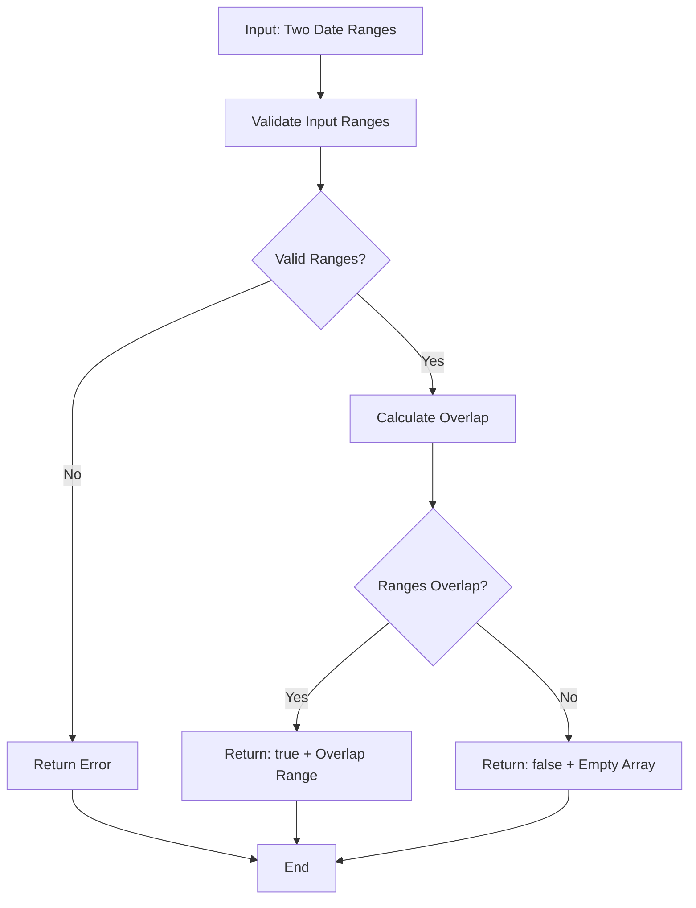

# Date Range Overlap Detection Feature - Product Requirements Document

## 1. Product Overview

This feature adds date range overlap detection capabilities to the atemporal library, allowing developers to determine if two date ranges intersect and retrieve the overlapping period. The feature enhances the library's temporal analysis capabilities by providing a robust, type-safe solution for range comparison operations commonly needed in scheduling, booking systems, and temporal data analysis.

## 2. Core Features

### 2.1 User Roles

No specific user roles are required for this feature as it's a library function accessible to all developers using the atemporal library.

### 2.2 Feature Module

Our date range overlap detection feature consists of the following main components:
1. **Core overlap detection function**: Primary API for checking range overlaps with configurable options
2. **Type definitions**: TypeScript interfaces for date ranges, overlap results, and configuration options
3. **Utility functions**: Helper functions for range validation, normalization, and edge case handling
4. **Integration module**: Seamless integration with existing atemporal date/time handling patterns

### 2.3 Page Details

| Component | Module Name | Feature Description |
|-----------|-------------|--------------------|
| Core API | Overlap Detection Engine | Accepts two date ranges, validates inputs, performs overlap calculation, returns structured result with boolean status and overlap period |
| Type System | TypeScript Definitions | Defines DateRange interface, OverlapResult type, configuration options, and error types for type safety |
| Validation | Input Validation | Validates date range inputs, handles invalid dates, checks range consistency (start <= end), normalizes timezone differences |
| Edge Cases | Boundary Handling | Manages touching ranges, zero-duration ranges, infinite ranges, and timezone boundary conditions |
| Integration | Library Integration | Follows existing atemporal patterns, integrates with current date/time utilities, maintains backward compatibility |

## 3. Core Process

### Main User Operation Flow

1. **Input Preparation**: Developer provides two date ranges (each with start and end dates)
2. **Validation Phase**: System validates input ranges for consistency and valid date values
3. **Overlap Calculation**: Core algorithm determines if ranges intersect and calculates overlap period
4. **Result Generation**: System returns structured result with overlap status and date range
5. **Error Handling**: Invalid inputs trigger appropriate error responses with descriptive messages

### API Usage Flow



## 4. User Interface Design

### 4.1 Design Style

As this is a library feature, there is no visual UI. However, the API design follows these principles:
- **Consistent naming**: Following atemporal library conventions with camelCase functions
- **Type safety**: Full TypeScript support with comprehensive type definitions
- **Error clarity**: Descriptive error messages and proper error types
- **Intuitive API**: Simple, predictable function signatures that match developer expectations
- **Documentation style**: JSDoc comments with examples and parameter descriptions

### 4.2 API Design Overview

| Component | Interface | Design Elements |
|-----------|-----------|----------------|
| Main Function | `checkDateRangeOverlap()` | Clean function signature, accepts two DateRange objects, returns OverlapResult type |
| Type Definitions | DateRange, OverlapResult | Intuitive property names (start, end, overlaps, overlapRange), optional configuration parameters |
| Error Handling | Custom Error Types | Specific error classes for different failure modes (InvalidDateRange, ValidationError) |
| Configuration | Options Object | Optional parameters for timezone handling, boundary inclusion, and validation strictness |

### 4.3 Responsiveness

Not applicable - this is a library function without visual interface. However, the API is designed to be responsive to different input formats and flexible configuration options to accommodate various use cases and developer preferences.

## 5. Technical Specifications

### 5.1 Function Signature

```typescript
function checkDateRangeOverlap(
  range1: DateRange,
  range2: DateRange,
  options?: OverlapOptions
): OverlapResult
```

### 5.2 Type Definitions

```typescript
interface DateRange {
  start: Date | string | number;
  end: Date | string | number;
}

interface OverlapResult {
  overlaps: boolean;
  overlapRange: DateRange | null;
}

interface OverlapOptions {
  includeBoundaries?: boolean; // Default: true
  timezone?: string;
  strictValidation?: boolean; // Default: true
}
```

### 5.3 Edge Cases

- **Touching ranges**: Ranges that share a boundary point (configurable inclusion)
- **Zero-duration ranges**: Ranges where start equals end
- **Invalid dates**: Malformed date inputs or impossible date values
- **Reversed ranges**: Ranges where start > end
- **Timezone differences**: Ranges in different timezones
- **Null/undefined inputs**: Missing or invalid range objects

### 5.4 Error Handling

- Input validation with descriptive error messages
- Custom error types for different failure scenarios
- Graceful handling of edge cases with configurable behavior
- Integration with existing atemporal error handling patterns

### 5.5 Performance Considerations

- Efficient overlap calculation algorithm (O(1) time complexity)
- Minimal object creation for memory efficiency
- Lazy evaluation of overlap range calculation
- Caching support for repeated calculations with same inputs