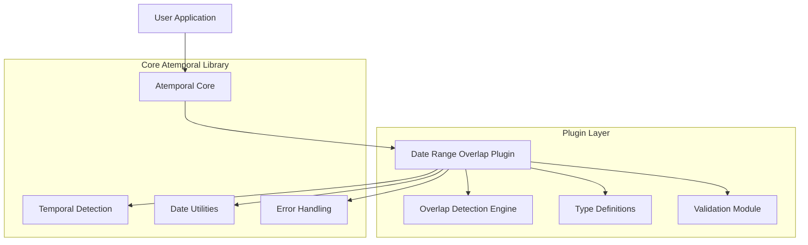

# Date Range Overlap Detection Plugin - Technical Architecture Document

## 1. Architecture Design



## 2. Technology Description

- Frontend: TypeScript plugin architecture following atemporal patterns
- Core Dependencies: Existing atemporal core utilities and temporal detection
- Plugin System: Modular plugin design with lazy loading support
- Type System: Full TypeScript support with comprehensive type definitions

## 3. Plugin Integration

### 3.1 Plugin Registration

| Integration Point | Purpose |
|-------------------|----------|
| Plugin Registration | Registers the dateRangeOverlap plugin with atemporal core |
| Type Extensions | Extends atemporal's TypeScript definitions with overlap types |
| Method Injection | Adds overlap detection methods to atemporal instances |
| Lazy Loading | Supports on-demand loading of the plugin functionality |

### 3.2 API Surface

```typescript
// Plugin extends atemporal with new methods
atemporal.extend(dateRangeOverlapPlugin);

// Usage after plugin registration
const result = atemporal().checkDateRangeOverlap(range1, range2);
const result = atemporal(date).rangeOverlapsWith(range);
```

## 4. API Definitions

### 4.1 Core Plugin API

**Date Range Overlap Detection**
```typescript
checkDateRangeOverlap(range1: DateRange, range2: DateRange, options?: OverlapOptions): OverlapResult
```

Request Parameters:
| Param Name | Param Type | isRequired | Description |
|------------|------------|------------|-------------|
| range1 | DateRange | true | First date range for comparison |
| range2 | DateRange | true | Second date range for comparison |
| options | OverlapOptions | false | Configuration options for overlap detection |

Response:
| Param Name | Param Type | Description |
|------------|------------|-------------|
| overlaps | boolean | Whether the ranges overlap |
| overlapRange | DateRange \| null | The overlapping period or null if no overlap |

Example:
```typescript
const range1 = { start: '2024-01-01', end: '2024-01-15' };
const range2 = { start: '2024-01-10', end: '2024-01-20' };

const result = atemporal().checkDateRangeOverlap(range1, range2);
// Returns: { overlaps: true, overlapRange: { start: '2024-01-10', end: '2024-01-15' } }
```

**Instance Method for Range Comparison**
```typescript
rangeOverlapsWith(range: DateRange, options?: OverlapOptions): OverlapResult
```

Request Parameters:
| Param Name | Param Type | isRequired | Description |
|------------|------------|------------|-------------|
| range | DateRange | true | Date range to compare with current instance |
| options | OverlapOptions | false | Configuration options |

Example:
```typescript
const currentRange = atemporal('2024-01-01').to('2024-01-15');
const result = currentRange.rangeOverlapsWith({ start: '2024-01-10', end: '2024-01-20' });
```

## 5. Plugin Architecture

### 5.1 Plugin Structure

```mermaid
graph TD
    A[dateRangeOverlapPlugin] --> B[Plugin Registration]
    A --> C[Core Functions]
    A --> D[Type Definitions]
    A --> E[Validation Logic]
    
    B --> F[extend() method]
    B --> G[Plugin metadata]
    
    C --> H[checkDateRangeOverlap()]
    C --> I[rangeOverlapsWith()]
    C --> J[Helper functions]
    
    D --> K[DateRange interface]
    D --> L[OverlapResult type]
    D --> M[OverlapOptions interface]
    
    E --> N[Input validation]
    E --> O[Date normalization]
    E --> P[Error handling]
```

### 5.2 Plugin File Structure

```
src/plugins/dateRangeOverlap.ts
├── Plugin registration and metadata
├── Core overlap detection logic
├── Type definitions and interfaces
├── Validation and error handling
└── Integration with atemporal core
```

## 6. Data Model

### 6.1 Type Definitions

```typescript
// Core date range interface
interface DateRange {
  start: Date | string | number;
  end: Date | string | number;
}

// Overlap detection result
interface OverlapResult {
  overlaps: boolean;
  overlapRange: DateRange | null;
}

// Configuration options
interface OverlapOptions {
  includeBoundaries?: boolean; // Default: true - whether touching ranges count as overlap
  timezone?: string; // Timezone for date interpretation
  strictValidation?: boolean; // Default: true - strict input validation
}

// Plugin metadata
interface DateRangeOverlapPlugin {
  name: 'dateRangeOverlap';
  version: string;
  dependencies?: string[];
  install: (atemporal: AtemporalCore) => void;
}
```

### 6.2 Error Types

```typescript
// Custom error types for the plugin
class InvalidDateRangeError extends Error {
  constructor(message: string, range?: DateRange) {
    super(message);
    this.name = 'InvalidDateRangeError';
  }
}

class OverlapDetectionError extends Error {
  constructor(message: string, ranges?: [DateRange, DateRange]) {
    super(message);
    this.name = 'OverlapDetectionError';
  }
}
```

### 6.3 Plugin Implementation Pattern

```typescript
// Plugin follows atemporal's plugin architecture
const dateRangeOverlapPlugin: DateRangeOverlapPlugin = {
  name: 'dateRangeOverlap',
  version: '1.0.0',
  
  install(atemporal: AtemporalCore) {
    // Extend atemporal prototype with new methods
    atemporal.prototype.checkDateRangeOverlap = function(range1, range2, options) {
      return checkDateRangeOverlap(range1, range2, options);
    };
    
    atemporal.prototype.rangeOverlapsWith = function(range, options) {
      const currentRange = { start: this.toDate(), end: this.toDate() };
      return checkDateRangeOverlap(currentRange, range, options);
    };
  }
};

export default dateRangeOverlapPlugin;
```

## 7. Integration Points

### 7.1 Core Library Integration

- **Temporal Detection**: Uses existing temporal detection for date parsing
- **Date Utilities**: Leverages atemporal's date manipulation functions
- **Error Handling**: Integrates with atemporal's error handling patterns
- **Type System**: Extends atemporal's TypeScript definitions

### 7.2 Plugin Loading

```typescript
// Manual plugin registration
import atemporal from 'atemporal';
import dateRangeOverlapPlugin from 'atemporal/plugins/dateRangeOverlap';

atemporal.extend(dateRangeOverlapPlugin);

// Or lazy loading
const atemporal = require('atemporal');
atemporal.extend('dateRangeOverlap'); // Auto-loads from plugins directory
```

### 7.3 Backward Compatibility

- Plugin is optional and doesn't affect core functionality
- Existing atemporal code continues to work without changes
- Plugin methods are only available after explicit registration
- Type definitions are additive and don't modify existing types